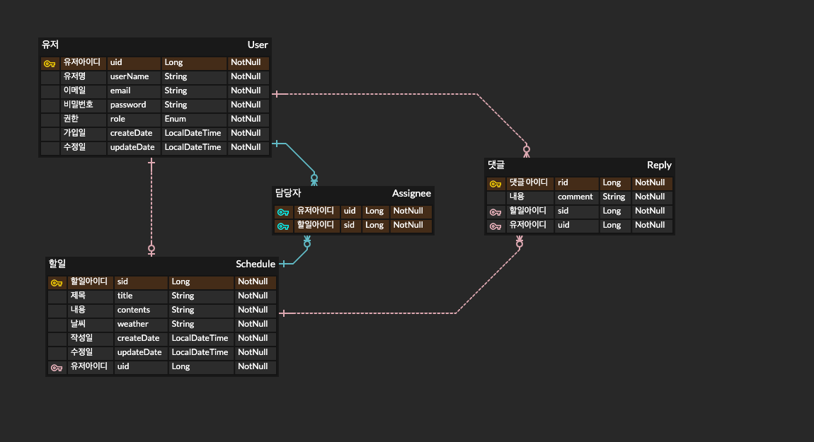

# 숙련 주차 skill-schdeule-management

## api 명세서
 
URL: https://documenter.getpostman.com/view/21326036/2sAXjJ5YT5

## ERD
 

1. **처음 설계한 API 명세서에 변경 사항이 있었나요?**
    - 변경되지 않았습니다.

2. **ERD를 먼저 설계한 후 Entity를 개발했을 때 어떤 점이 도움이 되셨나요?**
    - ERD를 먼저 설계함으로써 데이터베이스 구조와 엔터티 간의 관계를 명확하게 이해할 수 있었습니다.
    - 이로 인해 엔티티를 개발할 때 테이블 간의 관계, 속성, 제약 조건 등을 쉽게 반영할 수 있었고, 설계 단계에서 데이터 무결성을 미리 검토할 수 있었습니다. 
    - 또한, 개발 중에 예상치 못한 구조적인 문제가 발생할 가능성을 줄이고, 코드의 유지보수성도 향상되었습니다.

3. **JWT를 사용하여 인증/인가를 구현했을 때의 장점은 무엇일까요?**
    - JWT를 사용하면 클라이언트와 서버 간에 상태를 유지할 필요 없이 인증/인가를 처리할 수 있습니다. 
    - 토큰 자체에 사용자 정보와 권한 정보가 포함되어 있으므로, 서버는 토큰을 파싱하여 인증을 처리할 수 있습니다. 
    - 또한, JWT는 분산 시스템에서 쉽게 확장할 수 있고, 토큰의 서명을 통해 토큰의 무결성을 보장할 수 있습니다. 
    - 이는 인증/인가 처리 속도와 효율성을 높이며, 세션을 유지하기 위한 서버 측의 부하를 줄입니다.

4. **만약 댓글이 여러 개 달려있는 할 일을 삭제하려고 한다면 무슨 문제가 발생할까요?**
    - 댓글이 달려있는 할 일을 삭제할 때, 댓글들이 외래 키로 해당 할 일에 종속되어 있다면, 
    - 데이터 무결성 문제가 발생할 수 있습니다. 이를 해결하기 위해서는 `ON DELETE CASCADE`와 같은 옵션을 사용하여 할 일을 삭제할 때 해당 댓글들도 함께 삭제되도록 설정하거나, 
    - 먼저 댓글을 삭제한 후 할 일을 삭제하는 절차를 구현해야 합니다.
    - 그렇지 않으면 데이터베이스에서 참조 무결성 오류가 발생할 수 있습니다.

5. **연관관계를 설정할 때 단방향과 양방향으로 맺는 것의 차이점은 무엇일까요?**
    - **단방향 연관관계**: 한쪽 엔티티에서만 다른 엔터티를 참조하는 관계입니다. 단방향 관계에서는 참조하는 쪽에서만 외래 키를 관리하며, 상대 엔티티를 통해 역참조할 수 없습니다.
    - **양방향 연관관계**: 양쪽 엔티티에서 서로를 참조하는 관계입니다. 양방향 관계에서는 두 엔티티가 서로를 참조하며, 각각의 엔터티에서 상대 엔티티를 쉽게 접근할 수 있습니다.

    - **장단점**:
        - **단방향 연관관계**:
            - *장점*: 단순한 구조로, 필요한 데이터만 참조하므로 성능과 메모리 사용 측면에서 유리합니다.
            - *단점*: 역참조가 불가능하여 상대 엔티티의 데이터를 직접 접근할 수 없습니다.

        - **양방향 연관관계**:
            - *장점*: 양쪽 엔티티에서 서로를 참조할 수 있어 객체 탐색이 용이합니다. 또한, 두 엔티티 간의 관계를 더욱 명확하게 표현할 수 있습니다.
            - *단점*: 관계가 복잡해질 수 있고, 양방향 관계에서 데이터 무결성을 유지하기 위해 코드에서 양쪽의 상태를 동기화하는 추가적인 관리가 필요합니다. 잘못 설정된 경우 무한 루프 문제가 발생할 수도 있습니다.